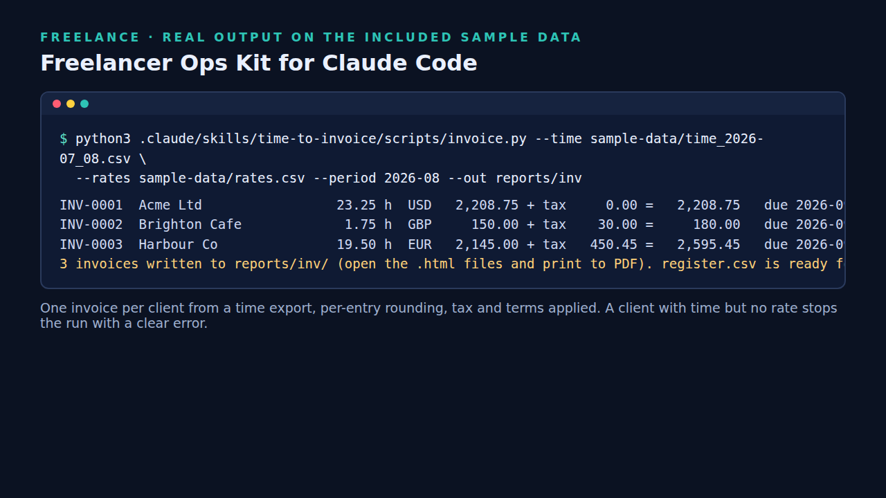

# Time-tracking CSV to client invoices (Claude Code skill)




A free [Claude Code](https://claude.com/claude-code) skill and standalone script that turns a time-tracking export (Toggl, Clockify, Harvest or a spreadsheet) into one printable invoice per client, plus a register CSV.
The script does all the arithmetic with exact decimals; Claude confirms your rates, rounding and tax, and explains the result.

## What it does
- Per-entry rounding (`--round 0.25 --round-mode up|nearest|none`), per-client rate, currency, tax/VAT rate, payment terms and minimum charge
- Sequential numbering (`--prefix INV --start 42`), due dates from terms
- Stops with a clear error if a client has time but no rate (nothing is silently skipped)
- Self-contained HTML invoices (print to PDF) and `register.csv`

## Try it (2 minutes)
```
git clone https://github.com/Hanru269/claude-code-time-to-invoice && cd claude-code-time-to-invoice
python3 .claude/skills/time-to-invoice/scripts/invoice.py --time sample-data/time_2026-07_08.csv --rates sample-data/rates.csv --period 2026-08 --start 42 --out out
python3 -m unittest discover -s tests
```
Expected (fictional data): Acme Ltd 23.25 h = 2,208.75 USD; Brighton Cafe 180.00 GBP (150 minimum charge + 20% tax); Harbour Co 2,595.45 EUR (21% VAT).
Or open Claude Code in the folder and ask: *Invoice September from sample-data/time_2026-07_08.csv using sample-data/rates.csv.*

## Limits
One tax rate per client; no discounts or expenses; plain HTML, not a validated e-invoice format; check what your country requires. Not tax, legal or accounting advice.

## More
This is one of six skills in the **Freelancer Ops Kit**: quotes with three-point estimates and milestone payments, scope-creep alerts with change-order values, an income dashboard, chasers and a rate calculator. [https://croucamp.gumroad.com/l/freelancer-ops-kit](https://croucamp.gumroad.com/l/freelancer-ops-kit)

MIT licensed.
